# Distributed Payment Authorization Engine — Design Document

> The deep technical design. For execution status see [roadmap.md](roadmap.md). For contributor rules see [agents.md](agents.md).

---

## 0. Document control

| Field | Value |
|---|---|
| **Title** | Distributed Payment Authorization Engine — Design Document |
| **Status** | DRAFT v0.1 |
| **Owners** | Single-engineer project (portfolio) |
| **Reviewers** | — |
| **Created** | 2026-05-17 |
| **Last updated** | 2026-05-17 |
| **Related** | [roadmap.md](roadmap.md), [agents.md](agents.md), `docs/adr/` |
| **Target audience** | Senior backend / platform / SRE engineers; hiring managers; the AI agents contributing code |

**How this document is structured.** It is read top-to-bottom for new readers, but every section is self-contained enough to be quoted in code review. Each section opens with the key claim or decision in **bold**.

---

## 1. Executive summary

**A Visa-style card authorization platform that approves or declines a transaction end-to-end in under 100 ms p99 at 2 000 RPS sustained, with idempotent ledger writes, saga-based compensation on partial failure, real-time fraud scoring (rules + ML), and a full GitOps rollout to EKS.**

| Metric | Target |
|---|---|
| Authorization latency p99 | < 100 ms |
| Sustained throughput | 2 000 RPS for 10 min (k6 soak) |
| Idempotency correctness | 10 000 concurrent same-key requests → exactly 1 ledger row |
| Saga correctness | Killing any single service mid-flow → 0 stuck reservations after 5 s |
| Availability (synthetic) | 99.9 % over rolling 30 days |
| Inner-loop speed | `make up && make smoke` first APPROVE < 60 s |

**Stack.** Go (hot path), Java 21 + Spring Boot 3 + WebFlux (fraud scoring), Python 3.12 + XGBoost (ML sidecar), DynamoDB (ledger), Redis (hot state), Postgres (relational), SNS+SQS (async backbone), Envoy (edge), Terraform + Helm + ArgoCD on EKS, OpenTelemetry → Prometheus / Tempo / Loki / Grafana.

**Top risks.** (a) Scope creep past 5 weeks — mitigated by phased gates in `roadmap.md`. (b) LocalStack drift from real AWS — mitigated by weekly staging validation. (c) p99 budget consumed by JVM tail — mitigated by hedged requests and circuit breakers.

---

## 2. Background & context

### 2.1 The card authorization domain in one minute

When a cardholder taps a card at a terminal:

1. **POS** sends an `Authorization` message to the **acquirer** (the merchant's bank).
2. The acquirer routes it via a **card network** (Visa, Mastercard, …) to the **issuer** (the cardholder's bank).
3. The issuer evaluates: card valid? funds available? fraud signals OK? merchant allowed?
4. The issuer responds APPROVE / DECLINE within a hard timeout (typically 2 s end-to-end, with our piece needing to be < 100 ms).
5. On APPROVE the issuer places a **hold** on the cardholder's account; the funds are not moved yet.
6. Later (T+0 or T+1), the merchant submits a **capture** that converts the hold into a real charge.
7. Settlement, refund, reversal, and chargeback flows extend this lifecycle over days/months.

This project implements the **issuer-side authorization core** — the part that decides APPROVE/DECLINE and writes the ledger entry. The acquirer and card network are simulated; nothing leaves our cluster.

### 2.2 Why this is hard

- **Latency is brutal.** End-to-end POS-to-issuer must be < 2 s; our issuer-side budget is < 100 ms.
- **Concurrency is real.** A card can be used at two terminals simultaneously; balance updates race.
- **Network retries duplicate.** Without idempotency keys, a single tap becomes two charges.
- **Partial failures need compensation.** If fraud declines after balance reserves, the reservation must be released — automatically, durably, even if our service crashes.
- **Fraud signals are synchronous.** A fraud check that takes 200 ms makes the whole transaction miss its budget.
- **Observability is non-negotiable.** A 3 a.m. p99 regression must be root-causable from a dashboard, not by re-deploying with logs added.

### 2.3 Industry context

| Player | What they do | What we borrow |
|---|---|---|
| **Visa / Mastercard** | The networks. Authorization in milliseconds, billions/day. | Latency budget mindset, ISO-8583 reason codes, idempotency. |
| **Stripe** | Modern issuer/acquirer platform. | Idempotency-key API design, structured error envelope, webhook signing. |
| **Adyen** | Unified commerce platform. | Saga-style flows for complex payment lifecycles. |
| **Square** | Acquirer + issuer. | Risk scoring patterns. |

### 2.4 Constraints we accept

- **PCI-aware, not certified.** Real PAN never enters the system; the edge tokenizes immediately.
- **No real card network.** POS is simulated by `curl` / k6.
- **Single region default.** Multi-region is a stretch goal.
- **USD only.** Schema supports more; FX is out of scope.

---

## 3. Goals & non-goals

### 3.1 Functional goals

- Authorize a card-present transaction with idempotency
- Capture an authorized transaction (T+0 or T+1)
- Reverse an authorization before capture
- Refund (full or partial) after capture
- Receive and record an issuer-initiated chargeback
- Score fraud risk in real time, returning a 0–1000 score and reason codes
- Reconcile settlement batches against the ledger daily
- Notify merchants of state changes via signed webhooks

### 3.2 Non-functional goals

- p99 authorization < 100 ms at 2 000 RPS sustained
- 99.9 % availability (synthetic, staging)
- Zero double-spend under concurrent same-key requests
- All cross-service calls observable: metric + log + trace
- Deployable to a fresh AWS account via `terraform apply` and `argocd app sync`
- Compromised single pod must not allow lateral movement (mTLS, IRSA)
- All secrets in AWS Secrets Manager, none in repo or env files

### 3.3 Non-goals (explicit)

- Real Visa / Mastercard network connectivity
- Real KYC / AML pipelines (stubbed)
- 3-D Secure step-up challenge flow (listed as stretch)
- Card issuance / physical card production
- PCI DSS certification (designed-for, not certified)
- Multi-currency FX conversion
- A mobile SDK or terminal firmware

### 3.4 Future-considered

- Kafka-based event sourcing (ADR-0010 stretch)
- Multi-region active-active via DynamoDB Global Tables
- WASM-hosted hot-reloadable fraud rules
- eBPF-based latency probing

---

## 4. Requirements

### 4.1 Functional requirements

| ID | Requirement |
|---|---|
| FR-001 | The system shall accept an authorization request with `card_token`, `amount`, `currency`, `merchant_id`, `idempotency_key`, `geo`, `channel`, `device_id`. |
| FR-002 | The system shall return `{decision, risk_score, reason_code, auth_code, trace_id}` for every authorization request. |
| FR-003 | Repeat requests with the same `idempotency_key` and identical body shall return the original response with no side effects. |
| FR-004 | Repeat requests with the same `idempotency_key` and a different body shall return `409 Conflict`. |
| FR-005 | The system shall place a balance hold on APPROVE and shall release it on REVERSE or expiry (7 days default). |
| FR-006 | A capture shall convert a hold into a settled ledger entry; partial captures shall be supported up to the held amount. |
| FR-007 | A refund shall produce a counter-entry; partial refunds shall be supported up to the captured amount. |
| FR-008 | Fraud scoring shall combine rule output and ML score into a 0–1000 risk score with a documented aggregation formula. |
| FR-009 | The system shall publish `txn.authorized`, `txn.declined`, `txn.captured`, `txn.reversed`, `txn.refunded`, `txn.chargedback` events to SNS. |
| FR-010 | Settlement shall close batches on a T+1 schedule and reconcile each batch against the ledger. |
| FR-011 | The system shall emit signed webhooks to merchants on every state transition, retrying with exponential backoff and a DLQ. |
| FR-012 | The system shall expose ISO-8583-style reason codes (`05`, `51`, `54`, `61`, `91`, …) on every decline. |

### 4.2 Non-functional requirements

| ID | Requirement |
|---|---|
| NFR-001 | Authorization p99 latency ≤ 100 ms at 2 000 RPS sustained 10 min (k6 soak in staging). |
| NFR-002 | Authorization p50 latency ≤ 35 ms at the same load. |
| NFR-003 | Saga compensation completes within 5 s of detecting a downstream failure. |
| NFR-004 | Synthetic availability ≥ 99.9 % over rolling 30 days in staging. |
| NFR-005 | Ledger writes shall survive a single AZ failure (DynamoDB regional). |
| NFR-006 | No PAN, CVV, full JWT, or PII shall appear in any log line; CI fails on regex match. |
| NFR-007 | All in-cluster traffic shall be mTLS; the edge shall terminate TLS 1.3 only. |
| NFR-008 | Cold start `make up && make smoke` returns APPROVE in < 60 s on a 16 GB laptop. |
| NFR-009 | RTO ≤ 1 h, RPO ≤ 5 min for ledger; documented in §14.4. |
| NFR-010 | Every alert in `observability/prometheus/rules/` has a runbook in `observability/runbooks/`. |
| NFR-011 | Compute cost in staging ≤ $300/month with auto-shutdown after 4 h idle. |

---

## 5. Capacity planning

**Fermi math, not vibes.** Every number below is sanity-checkable; replace estimates with measurements when available.

### 5.1 Traffic estimates

| Quantity | Value | Source |
|---|---|---|
| Sustained RPS (design target) | 2 000 | NFR-001 |
| Peak RPS (provisioned for) | 10 000 | 5× burst margin |
| Daily transactions | 173 M | 2 000 × 86 400 |
| Authorization payload (request) | 1.2 KB | proto + framing |
| Authorization payload (response) | 0.6 KB | decision + reason + trace |
| Network bandwidth, sustained | ~30 Mbps | (1.2 + 0.6) KB × 2 000 RPS × 8 |
| Network bandwidth, peak | ~150 Mbps | × 5 |

### 5.2 Storage estimates (1-year horizon)

**DynamoDB (ledger + idempotency + outbox + saga):**

| Item type | Bytes / row | Rows / day | Daily GB | 1-year GB | Retention |
|---|---|---|---|---|---|
| TXN (authorization) | 800 | 173 M | 138 | 50 400 | Cold-tier after 90 d |
| TXN (capture/refund/reversal) | 600 | 40 M | 24 | 8 760 | Cold-tier after 90 d |
| IDEMPOTENCY | 400 | 173 M | 69 | TTL 24 h ≈ 69 | Auto-expire |
| OUTBOX | 700 | 250 M | 175 | TTL 7 d ≈ 1 225 | Auto-expire after relay |
| SAGA | 500 | 173 M | 87 | TTL 24 h ≈ 87 | Auto-expire on completion |

Hot-tier (90 d) ≈ 60 TB / year; cold (S3 export) keeps everything older.

**Redis (hot state):**

| Use case | Keys | Bytes / key | Total |
|---|---|---|---|
| Account balance cache | 10 M active accounts | 256 | 2.4 GB |
| Idempotency response cache | 5 M (24 h TTL) | 1 024 | 4.9 GB |
| Rate-limit buckets | 1 M tenants × 4 windows | 64 | 256 MB |
| Fraud sliding windows (ZSET) | 10 M accounts | 1 024 | 9.5 GB |
| **Working set** | | | **~17 GB** |

Cluster: 3 shards × 8 GB (`cache.r7g.large`), replicas in 2 AZs → 6 nodes.

**Postgres (merchants, accounts, settlement, audit):**

| Table | Rows | Bytes / row | Total |
|---|---|---|---|
| `merchants` | 1 M | 1 KB | 1 GB |
| `cardholders` | 10 M | 800 | 8 GB |
| `accounts` | 12 M | 600 | 7 GB |
| `settlement_batches` | 365 × 5 K | 200 | 365 MB |
| `reconciliation_entries` | 40 M / year | 400 | 16 GB |
| **Total** | | | **~33 GB** |

**S3 (outbox archive, terraform state, model artifacts):**
- Outbox archive (after Dynamo TTL): ~6 TB/year compressed
- Terraform state: < 100 MB
- ML model artifacts (versioned): < 1 GB

### 5.3 Compute estimates (staging baseline)

| Service | Replicas | CPU req / lim | RAM req / lim | Notes |
|---|---|---|---|---|
| edge-gateway | 3 | 200 m / 1000 m | 256 / 512 Mi | Envoy is light |
| auth-service | 6 | 500 m / 2000 m | 512 / 1024 Mi | Hot path |
| balance-service | 4 | 200 m / 1000 m | 256 / 512 Mi | Redis-backed |
| fraud-service | 4 | 1000 m / 2000 m | 1 / 2 Gi | JVM heap |
| ml-scorer | 3 | 1000 m / 2000 m | 1 / 2 Gi | XGBoost in-mem |
| ledger-service | 6 | 500 m / 2000 m | 512 / 1024 Mi | Hot path |
| settlement-service | 2 | 200 m / 1000 m | 512 / 1024 Mi | Batch |
| notification-service | 2 | 100 m / 500 m | 128 / 256 Mi | Webhook fan-out |

Total request: ~10 vCPU, ~16 Gi RAM → 3× `m6i.xlarge` worker nodes plus 1× system-pool `m6i.large`.

### 5.4 Cost projection

| Env | EKS | RDS | Dynamo (on-demand) | Redis | NAT/data | Total / month |
|---|---|---|---|---|---|---|
| Local | $0 | $0 | $0 | $0 | $0 | **$0** |
| Staging (with auto-shutdown 4 h idle) | ~$120 | ~$30 | ~$15 | ~$50 | ~$30 | **~$245** |
| Prod (designed, not deployed) | ~$1 200 | ~$300 | ~$2 500 | ~$400 | ~$200 | **~$4 600** |

Validated via `infracost` on every Terraform PR.

---

## 6. High-level architecture

**Two traffic planes, one observability backbone.**

```
                         ┌──────────────────────────────┐
   POS / Merchant SDK ─▶ │   Edge / API Gateway (Envoy) │  mTLS, JWT, WAF, rate-limit
                         │   PAN tokenization here      │
                         └──────────────┬───────────────┘ ← PCI scope boundary
                                        │ gRPC + HTTP/2
                                        ▼
            ┌───────────────────────────────────────────────┐
            │   auth-service  (Go, hot path orchestrator)   │
            │   ── saga coordinator, idempotency keeper     │
            └─┬───────────┬───────────┬───────────┬─────────┘
              │ sync gRPC │ sync gRPC │ sync gRPC │ async outbox → SNS
              ▼           ▼           ▼           ▼
       ┌───────────┐┌───────────┐┌───────────┐┌──────────────────┐
       │  balance  ││   fraud   ││  ledger   ││  settlement +    │
       │  service  ││  service  ││  service  ││  notification    │
       │   (Go)    ││ (Java SB3 ││   (Go)    ││   (async SQS)    │
       └─────┬─────┘└─────┬─────┘└─────┬─────┘└─────────┬────────┘
             │            │             │                │
             │   ┌────────▼───────┐     │                │
             │   │  ml-scorer     │     │                │
             │   │  (Python,      │     │                │
             │   │   XGBoost)     │     │                │
             │   └────────────────┘     │                │
             ▼                          ▼                ▼
        ┌─────────┐                ┌──────────┐    ┌──────────┐
        │  Redis  │                │ DynamoDB │    │ Postgres │
        │ cluster │                │ (ledger) │    │  (RDS)   │
        └─────────┘                └──────────┘    └──────────┘

     Event backbone:  SNS (fan-out) → SQS (FIFO for ledger.events, Std for fan-out)
     Observability:   OTel SDK → OTel collector → {Prometheus, Tempo, Loki} → Grafana
     Secrets/keys:    AWS KMS + Secrets Manager  (LocalStack in dev)
```

**Sync plane** (must hit < 100 ms p99): edge → auth → (balance ∥ fraud) → ledger → response.

**Async plane** (off the hot path): outbox → SNS → fan-out to settlement, notification, fraud-feedback, analytics.

**PCI scope boundary** is the edge gateway: PAN enters there, is tokenized via KMS-envelope encryption, and only the opaque token crosses internal boundaries.

---

## 7. Detailed component design

### 7.1 edge-gateway

**Envoy in front, Go ext-authz sidecar for custom logic.**

| Aspect | Choice |
|---|---|
| TLS termination | Envoy listener, TLS 1.3 only, cert from cert-manager |
| AuthN | JWT RS256 validated by Envoy JWT filter against JWKS endpoint |
| AuthZ | Go ext-authz sidecar (`services/edge-gateway/extauthz/`) — checks merchant scope and per-tenant rate limit |
| Rate limiting | Redis sliding-window (per-IP + per-merchant) via ext-authz |
| WAF | Coraza embedded in Envoy (`coraza_filter`) — OWASP CRS rules |
| PAN tokenization | ext-authz intercepts `card_pan` field, calls KMS `Encrypt` (envelope: DEK encrypts PAN, KEK encrypts DEK) → emits `card_token` to downstream |
| Observability | Envoy access log → Loki; OTel filter emits traces |

**Listener chain** (Envoy YAML in `infra/envoy/listener.yaml`):

```
http_filters:
  - envoy.filters.http.jwt_authn       # validate JWT
  - envoy.filters.http.ext_authz       # rate limit + tokenize
  - envoy.filters.http.local_ratelimit # global hard ceiling
  - coraza_filter                      # WAF
  - envoy.filters.http.router          # forward to auth-service
```

### 7.2 auth-service

**The orchestrator on the hot path. Go 1.22+, gRPC server + thin HTTP shim.**

#### Internal package layout

```
services/auth-service/
├── cmd/server/main.go            # binary entry, lifecycle
├── internal/
│   ├── orchestrator/             # fan-out to balance/fraud, aggregate
│   ├── saga/                     # state machine, compensations
│   ├── idempotency/              # Dynamo conditional put, response cache
│   ├── decision/                 # score → bucket logic
│   ├── circuitbreaker/           # gobreaker wrappers per downstream
│   ├── clients/                  # generated + hand-tuned gRPC clients
│   ├── config/                   # viper + envconfig
│   └── obs/                      # OTel + zap setup
└── test/integration/             # testcontainers-based E2E
```

#### Saga coordinator

The saga drives: `RESERVE` (balance hold) → `SCORE` (fraud) → `COMMIT` (ledger) → respond. Compensations: `ReleaseHold`, `EmitReversalEvent`.

State persisted in Dynamo (`PK=SAGA#{saga_id}`, TTL 24 h, version-locked). On restart, a background scanner picks up `PENDING | IN_FLIGHT` sagas older than 30 s and resumes them.

#### Idempotency keeper

```
1. read Idempotency-Key header (required)
2. SHA-256 the request body
3. Dynamo PutItem PK=IDEMP#{key} with ConditionExpression: attribute_not_exists(PK) OR body_hash = :h
   - success → proceed; record(this attempt)
   - condition failed, body_hash differs → return 409 Conflict
   - condition failed, body_hash matches → fetch cached response, return it
4. on completion, update IDEMP row with cached response + TTL 24h
```

Race-safe by construction: only one writer wins the conditional put per key.

#### Latency budget within auth-service

| Step | Budget |
|---|---|
| Decode + validate | 1 ms |
| Idempotency lookup | 5 ms |
| Saga start + Dynamo write | 4 ms |
| Parallel fan-out (balance ∥ fraud→ml) | 28 ms (max of the two) |
| Aggregate + decision | 1 ms |
| Ledger conditional write | 15 ms |
| Outbox write (same Dynamo txn) | 0 (same item, single write) |
| Response marshalling | 1 ms |
| **Subtotal** | **55 ms** (45 ms slack for network jitter) |

### 7.3 balance-service

**Go gRPC service. Redis-first, Postgres write-through.**

| Operation | Semantics |
|---|---|
| `Lookup(account_id)` | `GET account:{id}` in Redis; on miss, load from Postgres, set with 5-min TTL |
| `Hold(account_id, amount, hold_id)` | Lua script: check `available_balance >= amount`; if yes, decrement `available_balance`, append `hold_id` to `holds` hash, return new balance. Atomic per shard. |
| `Release(account_id, hold_id)` | Lua script: increment `available_balance` by hold amount, remove from `holds` hash |
| `Capture(account_id, hold_id, amount)` | Lua script: remove hold, decrement `posted_balance` by amount |

**Redis keys** (hash-tagged for cluster-mode locality):

```
{account:123}:balance   -- HASH { available, posted, currency }
{account:123}:holds     -- HASH { hold_id -> amount }
{account:123}:version   -- STRING (used for write-through dedup)
```

Write-through to Postgres happens **async** on a debounced 5-second window per account — Redis is authoritative on the hot path; Postgres is the recovery store.

### 7.4 fraud-service

**Java 21 + Spring Boot 3 + WebFlux. Reactive gRPC server on Netty.**

#### Architecture

```
ScoreRequest (proto)
  ↓
@GrpcService FraudGrpcService
  ↓
Mono<RiskScore> = RuleRegistry.all()
                   .map(rule -> rule.evaluate(ctx))   // each rule is reactive
                   .collectList()
                   .zipWith(mlClient.score(ctx))      // gRPC to ml-scorer
                   .map(aggregator::combine)
  ↓
ScoreResponse (proto)
```

#### Rule SPI

```java
public interface RiskRule {
    String code();              // stable identifier, e.g. "VEL-001"
    int weight();               // 0..100, summed into score
    Mono<RuleVerdict> evaluate(ScoringContext ctx);
}
```

Rules are Spring beans auto-registered by `RuleRegistry`. New rules drop into `services/fraud-service/src/main/java/com/cc/fraud/rules/` — see `agents.md` §4.

#### Initial rule set

| Code | Rule | Window | Source |
|---|---|---|---|
| VEL-001 | Velocity: count of auths per card in last 60s > 5 | Redis ZSET | per-card |
| VEL-002 | Velocity: sum of auth amounts last 5 min > $5 000 | Redis ZSET | per-card |
| GEO-001 | Geo jump: location > 500 km from last auth in last 1 h | Redis hash | per-card |
| MCC-001 | MCC tier: high-risk merchant category (e.g. 7995 gambling) | Postgres | per-merchant |
| DEV-001 | Device fingerprint mismatch with cardholder's known devices | Postgres | per-card |
| TOD-001 | Time-of-day anomaly: auth at 3 a.m. local for daytime-only card | Cardholder profile | per-card |

#### Score aggregation

```
final_score = clamp(0, 1000, sum(rule.weight if rule.verdict == HIT) + ml_score)
bucket:
  final_score <= 300  → APPROVE
  300 < final_score <= 700 → REVIEW    (returns DECLINE 'R0' to caller, queues for manual)
  final_score > 700   → DECLINE
```

ADR-0007 covers the aggregation choice (additive + ML, not Bayesian — chosen for explainability).

### 7.5 ml-scorer

**Python 3.12, `grpcio.aio` async server, XGBoost in-memory model.**

#### Features (24 total, all numeric)

| Group | Features |
|---|---|
| Transaction | amount, mcc, hour_of_day, day_of_week |
| Velocity | count_60s, sum_60s, count_5m, sum_5m, count_24h, sum_24h |
| Geo | distance_from_last_km, country_change_flag, distance_from_home_km |
| Device | device_seen_before_flag, device_age_days |
| History | days_since_first_txn, distinct_merchants_30d, decline_rate_30d |
| Risk profile | cardholder_risk_tier (0..4), merchant_risk_tier (0..4) |

#### Training pipeline (`services/ml-scorer/train.py`)

1. Generate 10 M synthetic txns via `data/generate.py` (Faker + Gaussian noise)
2. Inject fraud patterns (velocity bursts, geo-impossible, midnight on daytime cards) — ~3 % labels
3. SMOTE-balance labels to 50/50 for training
4. Train XGBoost: `max_depth=6`, `n_estimators=300`, `learning_rate=0.1`, early stopping on validation AUC
5. Target AUC ≥ 0.85 on held-out test split
6. Serialize to `model/model_<sha>.bin` + `model/manifest.json`

#### Serving

- Model loaded at boot; refused to start if missing
- gRPC method `Score(features)` returns `{score: int [0..1000], model_version: string}`
- p99 inference target: < 5 ms
- Prometheus `ml_scorer_inference_duration_seconds{model_version}` for regression detection

### 7.6 ledger-service

**Go gRPC service. The bookkeeping system of record.**

#### Internal design

Three concerns:

1. **Conditional writes** with optimistic locking
2. **Outbox emission** (event written in the same Dynamo `PutItem`)
3. **A background relay** that polls outbox and publishes to SNS

For the Dynamo table layout see §8.1. Concrete write algorithm:

```
1. caller supplies LedgerEntry (txn_id, account_id, amount, type, version_expected)
2. ledger-service constructs:
   - main item: PK=ACCT#{account_id}, SK=TXN#{ulid}, version=version_expected+1
   - outbox item: PK=OUTBOX#{event_id}, SK=PENDING, payload=...
3. TransactWriteItems with:
   - main: ConditionExpression "attribute_not_exists(PK) AND attribute_not_exists(SK)"
   - outbox: ConditionExpression "attribute_not_exists(PK)"
4. on success → return; outbox relay picks up async
5. on ConditionalCheckFailedException → return AlreadyExists or VersionMismatch
```

#### Outbox relay

A separate goroutine inside ledger-service pods (or a dedicated worker — TBD ADR-0008):

```
loop:
  items = Query(OUTBOX where status=PENDING limit 100)
  for each: SNS.Publish; on ack, UpdateItem status=DELIVERED, ttl=now+7d
```

At-least-once delivery; consumers must be idempotent (they are — every consumer keys off `event_id`).

### 7.7 settlement-service

**Java SB3, SQS consumer. T+1 batch close + reconciliation + chargeback.**

| Workflow | Trigger | Steps |
|---|---|---|
| Batch open | Hourly cron | Create `settlement_batches` row, state=OPEN |
| Entry append | SQS message `txn.captured` | Append to current OPEN batch |
| Batch close | Daily cron T+1 03:00 UTC | OPEN → CLOSING; freeze entries |
| Reconcile | Immediately after close | Compare batch entries vs ledger query for window → write `reconciliation_entries` |
| Disposition | After reconcile | Match → SETTLED; mismatch → DISPUTED, alert PagerDuty |
| Chargeback | SQS message `chargeback.received` | Create counter-entry, mark settlement_entry CHARGEDBACK |

**Reconciliation algorithm:** symmetric set difference between (settlement_batch_entries) and (ledger TXN of type CAPTURE in window). Differences logged with `reason`.

### 7.8 notification-service

**Go, SQS consumer. Signed webhooks to merchant endpoints.**

```
on SQS msg (from txn.* topics):
  merchant = lookup merchant.webhook_url and merchant.webhook_secret
  body = canonical-JSON(event)
  signature = HMAC-SHA256(merchant.webhook_secret, "{timestamp}.{body}")
  POST merchant.webhook_url with headers:
    X-CC-Timestamp: <ts>
    X-CC-Signature: <sig>
    X-CC-Event-Id: <event_id>
  if 2xx → ack
  if 5xx or timeout → nack with retry (backoff: 1s, 5s, 30s, 5m, 30m, 6h, 24h)
  after 7 retries → DLQ ('webhook-dlq')
```

DLQ is replayable via `scripts/replay-webhooks.sh <merchant_id>`.

---

## 8. Data model

### 8.1 DynamoDB single-table design

**One table: `cc-ledger-{env}`. Single-table design avoids cross-table transactions and enables item-collection scans.**

#### Base table

| Attribute | Type | Notes |
|---|---|---|
| `PK` | S | Partition key — entity prefix + id |
| `SK` | S | Sort key — sub-entity or timestamp |
| `type` | S | Item type discriminator |
| `version` | N | Optimistic-lock counter (mutable rows only) |
| `ttl` | N | Epoch seconds; Dynamo TTL evicts when reached |
| `gsi1pk`, `gsi1sk` | S | GSI1 keys (merchant view) |
| `gsi2pk`, `gsi2sk` | S | GSI2 keys (idempotency lookup) |
| `gsi3pk`, `gsi3sk` | S | GSI3 keys (outbox status) |
| `payload` | M | Type-specific attributes |

#### Item shapes

```
TXN (authorization)
  PK   = ACCT#<account_id>
  SK   = TXN#<ulid>
  type = TXN_AUTH | TXN_CAPTURE | TXN_REVERSAL | TXN_REFUND | TXN_CHARGEBACK
  payload = { amount, currency, merchant_id, decision, risk_score, reason_code, ... }
  gsi1pk = MERCH#<merchant_id>; gsi1sk = TXN#<ulid>

IDEMPOTENCY
  PK   = IDEMP#<idempotency_key>
  SK   = META
  type = IDEMP
  payload = { body_hash, response_blob, txn_id, status }
  ttl  = now + 24h

SAGA
  PK   = SAGA#<saga_id>
  SK   = STATE
  type = SAGA
  version = N (lock)
  payload = { state, steps[], compensations[], txn_id }
  ttl  = now + 24h

OUTBOX
  PK   = OUTBOX#<event_id>
  SK   = PENDING | IN_FLIGHT | DELIVERED
  type = OUTBOX
  gsi3pk = OUTBOX_STATUS#<status>; gsi3sk = <created_at_iso>
  payload = { aggregate_id, event_type, payload_blob }
  ttl  = delivered_at + 7d

ACCOUNT (rarely-changing reference data; bulk lives in Postgres)
  PK   = ACCT#<account_id>
  SK   = META
  type = ACCT
  payload = { currency, status, kyc_tier, created_at }
```

#### Global secondary indexes

| Index | PK | SK | Use case | Projection |
|---|---|---|---|---|
| GSI1 | `gsi1pk = MERCH#<id>` | `gsi1sk = TXN#<ulid>` | Merchant view: all txns for a merchant in time order | ALL |
| GSI2 | `gsi2pk = IDEMP#<key>` | `gsi2sk = META` | Idempotency lookup by external key | ALL |
| GSI3 | `gsi3pk = OUTBOX_STATUS#<s>` | `gsi3sk = <created_at>` | Outbox relay scan over PENDING events | KEYS_ONLY (saves cost; relay then BatchGet) |

#### Access-pattern matrix

| # | Pattern | Operation | Index | Consistency |
|---|---|---|---|---|
| 1 | Get account meta | GetItem | Base | Strong |
| 2 | List recent txns for account (paginated) | Query `PK=ACCT#<id> BEGINS_WITH SK=TXN#` | Base | Eventual |
| 3 | Get single txn by id | GetItem | Base | Strong |
| 4 | Write authorization (conditional, lock account version) | TransactWriteItems | Base | Strong |
| 5 | Write capture (conditional on AUTH exists, not yet captured) | TransactWriteItems | Base | Strong |
| 6 | Lookup by idempotency key | Query GSI2 | GSI2 | Eventual (fine; rate-limited by Dynamo replication) |
| 7 | Create idempotency record (conditional put) | PutItem with `attribute_not_exists(PK)` | Base | Strong |
| 8 | Read saga state for resume | GetItem | Base | Strong |
| 9 | Update saga state (lock by version) | UpdateItem with `version = :v` | Base | Strong |
| 10 | Scan pending outbox events | Query GSI3 `gsi3pk=OUTBOX_STATUS#PENDING` | GSI3 | Eventual |
| 11 | Mark outbox event delivered | UpdateItem with `status` change | Base | Strong |
| 12 | List txns for a merchant in a time window | Query GSI1 with range on `gsi1sk` | GSI1 | Eventual |
| 13 | Compute account balance from ledger (replay) | Query base, fold | Base | Eventual |
| 14 | Find all txns of type CAPTURE in window for settlement | Filter on Query GSI1 | GSI1 | Eventual |
| 15 | Find expired idempotency records (admin) | Scan (rare) + TTL handles automatically | Base | Eventual |
| 16 | List CHARGEDBACK txns by merchant | Query GSI1 + filter | GSI1 | Eventual |
| 17 | Write chargeback (counter-entry) | TransactWriteItems | Base | Strong |
| 18 | Reverse an authorization (mark + emit event) | TransactWriteItems | Base | Strong |
| 19 | Refund (partial allowed) | TransactWriteItems with amount check | Base | Strong |
| 20 | Outbox replay (admin tool, by event id range) | Query GSI3 with filter | GSI3 | Eventual |
| 21 | Account balance read-modify-write under contention | Read + conditional UpdateItem on `version` | Base | Strong |

#### Hot-partition mitigation

- Account IDs are ULID-prefixed; ULID front-loads timestamp, but the **PK is `ACCT#<id>`** with full ULID, distributing across partitions.
- High-volume merchants get a write-shard suffix: `MERCH#<id>#<shard>` where `shard = hash(txn_id) % 10` on writes; reads aggregate across all 10 shards.
- TXN write sort key is `TXN#<ulid>` (timestamp-prefixed) — sequential within an account but accounts spread evenly across partitions, so no hot shard at the table level.

#### Capacity & cost

On-demand mode for v1 (no capacity tuning required). Reassess at 5k+ sustained RPS; provisioned + auto-scaling typically wins above that.

#### TTL strategy

| Item type | TTL |
|---|---|
| TXN | none (long-term ledger; offload to S3 export after 90 d via separate process) |
| IDEMPOTENCY | 24 h from creation |
| SAGA | 24 h from completion |
| OUTBOX | 7 d after delivery |
| ACCOUNT meta | none |

### 8.2 Redis schema

**Cluster mode, 3 shards × 1 replica per shard, 6 nodes total.**

| Pattern | Data structure | Notes |
|---|---|---|
| `{account:<id>}:balance` | HASH `{ available, posted, currency }` | Hot-path read |
| `{account:<id>}:holds` | HASH `{ hold_id → amount }` | Reservation tracking |
| `{account:<id>}:version` | STRING | Dedup token for async write-through |
| `{account:<id>}:vel:60s` | ZSET (score=timestamp) | Velocity window (count + sum) |
| `{account:<id>}:vel:24h` | ZSET | Day-long velocity |
| `{account:<id>}:geo:last` | HASH `{ lat, lng, country, ts }` | Last seen location |
| `idemp:<key>` | STRING (JSON response) | 24 h TTL, hot cache (Dynamo is durable) |
| `rl:{merchant:<id>}:1s` | STRING (counter) | Sliding-window rate-limit |

**Hash-tag rule:** every multi-key Lua script uses `{account:<id>}` so all keys for one account hash to the same slot. Violating this fails CI via `redis-cluster-check`.

**Eviction:** `allkeys-lfu`. **Persistence:** AOF every-sec. **Memory headroom:** target < 70 % utilization to leave room for replication and forks.

### 8.3 Postgres schema

**RDS Postgres 16, single writer + read replica.**

```sql
CREATE TABLE merchants (
    id              UUID PRIMARY KEY,
    name            TEXT NOT NULL,
    mcc             CHAR(4) NOT NULL,
    country         CHAR(2) NOT NULL,
    risk_tier       SMALLINT NOT NULL CHECK (risk_tier BETWEEN 0 AND 4),
    webhook_url     TEXT,
    webhook_secret_arn TEXT,
    status          TEXT NOT NULL,
    created_at      TIMESTAMPTZ NOT NULL DEFAULT now()
);
CREATE INDEX merchants_mcc_idx ON merchants (mcc);

CREATE TABLE cardholders (
    id              UUID PRIMARY KEY,
    kyc_tier        SMALLINT NOT NULL,
    risk_tier       SMALLINT NOT NULL,
    home_country    CHAR(2),
    home_lat        NUMERIC(9,6),
    home_lng        NUMERIC(9,6),
    created_at      TIMESTAMPTZ NOT NULL DEFAULT now()
);

CREATE TABLE accounts (
    id              UUID PRIMARY KEY,
    cardholder_id   UUID NOT NULL REFERENCES cardholders(id),
    currency        CHAR(3) NOT NULL,
    status          TEXT NOT NULL,
    -- balance snapshot for recovery; Redis is authoritative
    available_cached NUMERIC(18,2),
    posted_cached    NUMERIC(18,2),
    cached_at        TIMESTAMPTZ,
    created_at      TIMESTAMPTZ NOT NULL DEFAULT now()
);
CREATE INDEX accounts_cardholder_idx ON accounts (cardholder_id);

CREATE TABLE settlement_batches (
    id              UUID PRIMARY KEY,
    window_start    TIMESTAMPTZ NOT NULL,
    window_end      TIMESTAMPTZ NOT NULL,
    state           TEXT NOT NULL,  -- OPEN, CLOSING, SETTLED, RECONCILED, DISPUTED
    entry_count     INTEGER NOT NULL DEFAULT 0,
    total_amount    NUMERIC(18,2) NOT NULL DEFAULT 0,
    created_at      TIMESTAMPTZ NOT NULL DEFAULT now(),
    closed_at       TIMESTAMPTZ
);
CREATE INDEX settlement_batches_state_idx ON settlement_batches (state, window_end);

CREATE TABLE reconciliation_entries (
    id              UUID PRIMARY KEY,
    batch_id        UUID NOT NULL REFERENCES settlement_batches(id),
    txn_id          TEXT NOT NULL,
    expected_amount NUMERIC(18,2) NOT NULL,
    observed_amount NUMERIC(18,2),
    status          TEXT NOT NULL,  -- MATCH, MISMATCH, MISSING, EXTRA
    note            TEXT,
    created_at      TIMESTAMPTZ NOT NULL DEFAULT now()
) PARTITION BY RANGE (created_at);

CREATE TABLE audit_log (
    id              BIGSERIAL PRIMARY KEY,
    actor           TEXT NOT NULL,    -- service name or user id
    action          TEXT NOT NULL,
    target          TEXT NOT NULL,
    metadata        JSONB,
    created_at      TIMESTAMPTZ NOT NULL DEFAULT now()
) PARTITION BY RANGE (created_at);
```

`reconciliation_entries` and `audit_log` are range-partitioned by month for retention management; old partitions detach to S3 via pg_partman + aws_s3.

### 8.4 Protobuf message catalog

See `proto/` for canonical source. Excerpt of the `Authorize` flow:

```proto
// proto/auth/v1/auth.proto
syntax = "proto3";
package cc.auth.v1;

service AuthorizationService {
  rpc Authorize(AuthorizeRequest) returns (AuthorizeResponse);
  rpc Capture(CaptureRequest)     returns (CaptureResponse);
  rpc Reverse(ReverseRequest)     returns (ReverseResponse);
  rpc Refund(RefundRequest)       returns (RefundResponse);
}

message AuthorizeRequest {
  string idempotency_key = 1;
  string card_token      = 2;   // opaque, KMS-tokenized at edge
  Money  amount          = 3;
  string merchant_id     = 4;
  Geo    geo             = 5;
  string channel         = 6;   // POS, ECOM, MOTO
  string device_id       = 7;
}

message AuthorizeResponse {
  Decision decision     = 1;    // APPROVE | DECLINE | REVIEW
  int32    risk_score   = 2;    // 0..1000
  string   reason_code  = 3;    // ISO-8583 inspired
  string   auth_code    = 4;
  string   trace_id     = 5;
  string   txn_id       = 6;
}

message Money { string currency = 1; int64 minor_units = 2; }
message Geo   { double lat = 1; double lng = 2; string country = 3; }
enum Decision { DECISION_UNSPECIFIED = 0; APPROVE = 1; DECLINE = 2; REVIEW = 3; }
```

All proto files validated by `buf lint` + `buf breaking` in CI. Field numbers are **immutable**; renaming is allowed, removal isn't.

---

## 9. API contracts

### 9.1 External HTTP API (POS-facing)

**Base URL:** `https://api.<env>.cc.example.com/v1`. JSON over HTTPS, mTLS optional for high-trust merchants.

#### `POST /v1/authorize`

```
Headers:
  Authorization: Bearer <JWT>
  Idempotency-Key: <ulid>      (required)
  Content-Type: application/json
  Traceparent: <W3C>           (optional; generated if absent)

Body:
{
  "card_token": "tok_...",      // opaque, never PAN
  "amount":     { "currency": "USD", "minor_units": 12345 },
  "merchant_id": "mch_...",
  "geo":        { "lat": 37.77, "lng": -122.41, "country": "US" },
  "channel":    "POS",
  "device_id":  "dev_..."
}

Response 200 (also for DECLINE — decline ≠ HTTP error):
{
  "decision":    "APPROVE",
  "risk_score":  127,
  "reason_code": "00",
  "auth_code":   "AB12CD",
  "txn_id":      "txn_01HXYZ...",
  "trace_id":    "00-abc-def-01"
}

Error responses (system errors, not declines):
  400 invalid request body
  401 invalid JWT
  409 Idempotency-Key conflict (same key, different body)
  429 rate limited
  500 unhandled error
  503 downstream unavailable (after circuit breaker open)
  504 deadline exceeded
```

#### Other endpoints

| Method | Path | Purpose |
|---|---|---|
| `POST` | `/v1/capture/{txn_id}` | Capture an authorized hold |
| `POST` | `/v1/reverse/{txn_id}` | Reverse before capture |
| `POST` | `/v1/refund/{txn_id}` | Refund after capture (full or partial) |
| `GET`  | `/v1/transactions/{txn_id}` | Fetch txn state |
| `GET`  | `/v1/health`           | Liveness (always 200 if process up) |
| `GET`  | `/v1/ready`            | Readiness (200 only if all critical deps reachable) |

#### Error envelope

```json
{
  "error": {
    "code": "INVALID_REQUEST",
    "message": "amount.minor_units must be positive",
    "field": "amount.minor_units",
    "trace_id": "00-..."
  }
}
```

#### Versioning

URL-versioned (`/v1`). Backwards-incompatible changes bump to `/v2`; deprecation policy is 12 months with a `Deprecation: Sun, ...` header.

### 9.2 Internal gRPC contracts

Five services expose gRPC. Each method has:

- A **deadline** propagated from the caller's `context`. Without a deadline, the server uses 1 s as default and logs a warning.
- An **error model**: gRPC status code + `google.rpc.Status` with one `ErrorDetails` extension per error class (e.g. `RetryInfo`, `BadRequest`, `PreconditionFailure`).
- **Bidirectional streaming** only on settlement export (batch download). All other methods are unary.

| Service | Methods |
|---|---|
| `AuthorizationService` | `Authorize`, `Capture`, `Reverse`, `Refund`, `Get` |
| `BalanceService` | `Lookup`, `Hold`, `Release`, `Capture` |
| `FraudService` | `Score` |
| `LedgerService` | `Write`, `Read`, `Replay`, `OutboxPoll` (admin) |
| `MLScoreService` | `Score` |

---

## 10. Critical flows — sequence diagrams

### 10.1 Happy-path authorization

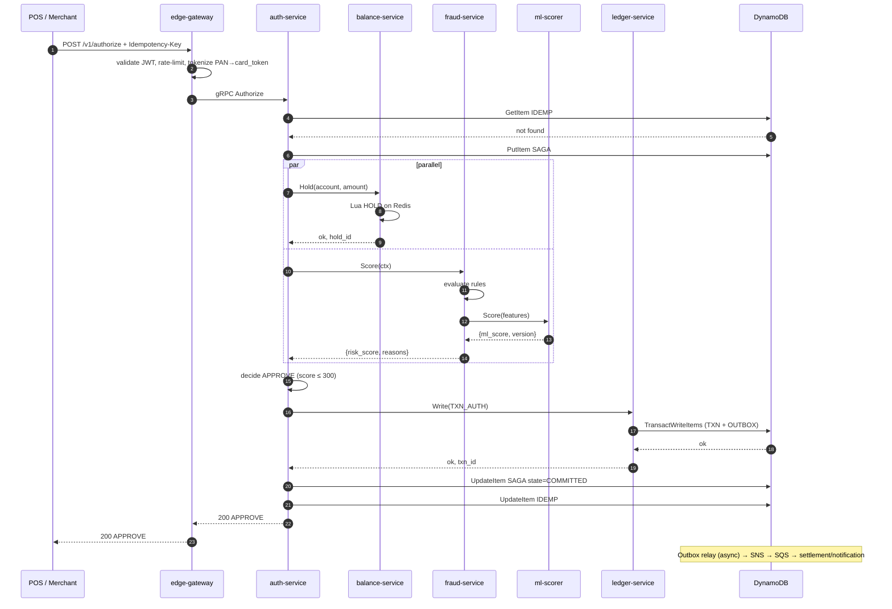

### 10.2 Fraud REVIEW outcome

```mermaid
sequenceDiagram
    autonumber
    participant POS
    participant E as edge
    participant A as auth
    participant F as fraud
    participant L as ledger

    POS->>E: POST /v1/authorize
    E->>A: Authorize
    A->>F: Score
    F-->>A: risk_score=550 (REVIEW band)
    A->>A: bucket → REVIEW; return 'R0' to POS
    A->>L: Write(TXN_AUTH state=REVIEW_HELD)
    L-->>A: ok
    A-->>POS: 200 DECLINE reason=R0
    Note over A,L: Async: review-service queue gets the txn for manual review
```

### 10.3 DECLINE on insufficient funds

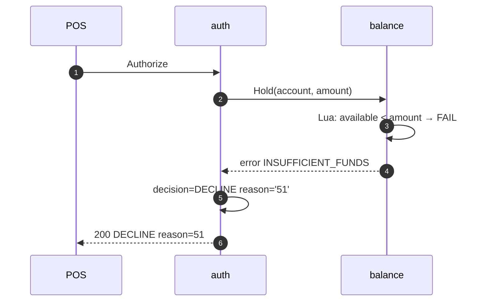

### 10.4 Idempotent retry

```mermaid
sequenceDiagram
    autonumber
    participant POS
    participant A as auth
    participant D as DynamoDB

    POS->>A: Authorize Idempotency-Key=K1 body=B1
    A->>D: ConditionalPut IDEMP#K1
    D-->>A: ok (first time)
    Note over A: full flow runs, response cached
    POS->>A: Authorize Idempotency-Key=K1 body=B1 (retry)
    A->>D: ConditionalPut IDEMP#K1
    D-->>A: ConditionalCheckFailed; existing body_hash matches
    A->>D: GetItem IDEMP#K1
    D-->>A: cached response
    A-->>POS: 200 APPROVE (cached)
    POS->>A: Authorize Idempotency-Key=K1 body=B2 (different body)
    A->>D: ConditionalPut
    D-->>A: ConditionalCheckFailed; body_hash differs
    A-->>POS: 409 Conflict
```

### 10.5 Saga compensation when ledger fails

```mermaid
sequenceDiagram
    autonumber
    participant A as auth
    participant B as balance
    participant F as fraud
    participant L as ledger
    participant D as DynamoDB

    A->>B: Hold
    B-->>A: ok, hold_id=H1
    A->>F: Score
    F-->>A: APPROVE
    A->>L: Write(TXN_AUTH)
    L--xA: error UNAVAILABLE (CB open)
    A->>D: UpdateItem SAGA state=COMPENSATING
    A->>B: Release(account, H1)
    B-->>A: ok
    A->>D: PutItem OUTBOX type=AUTH_FAILED
    A->>D: UpdateItem SAGA state=COMPENSATED
    A-->>A: return 503 to caller; client may retry with new Idempotency-Key
```

### 10.6 Capture

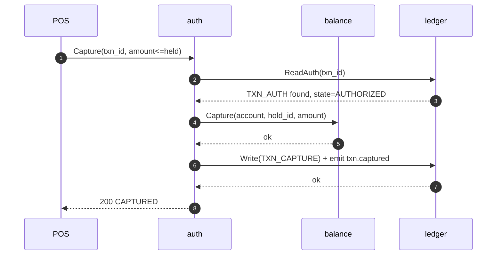

### 10.7 Refund

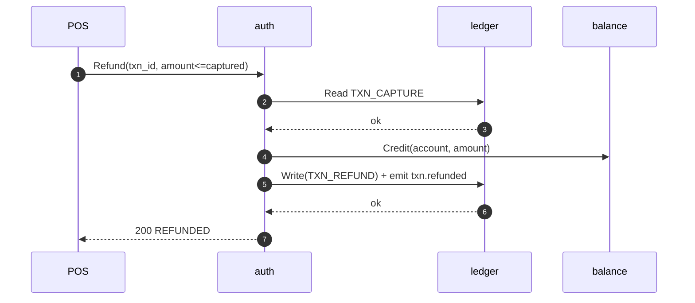

### 10.8 Reversal (pre-capture)

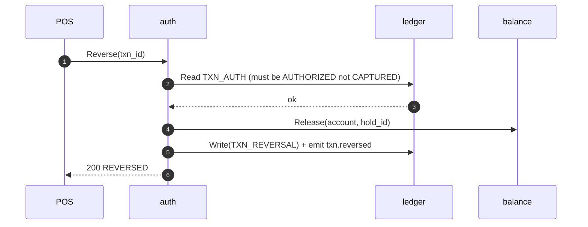

### 10.9 Chargeback inbound

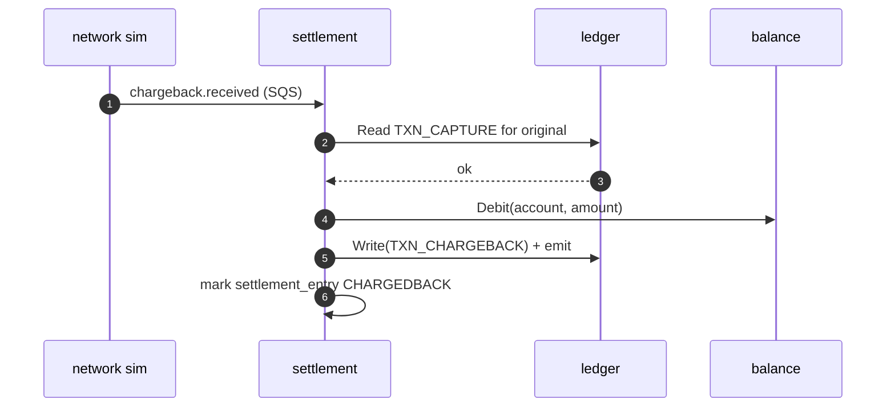

### 10.10 Settlement batch close + reconciliation

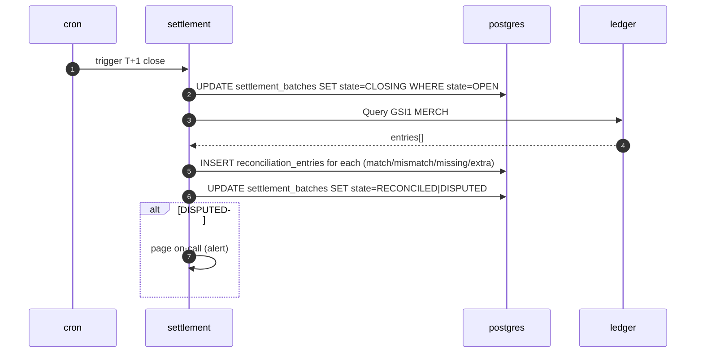

### 10.11 Webhook delivery, retry, DLQ

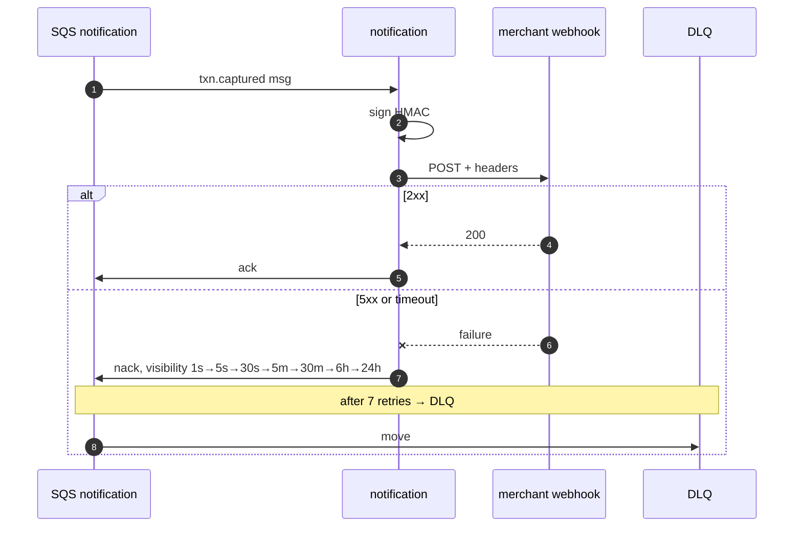

---

## 11. State machines

### 11.1 Transaction lifecycle

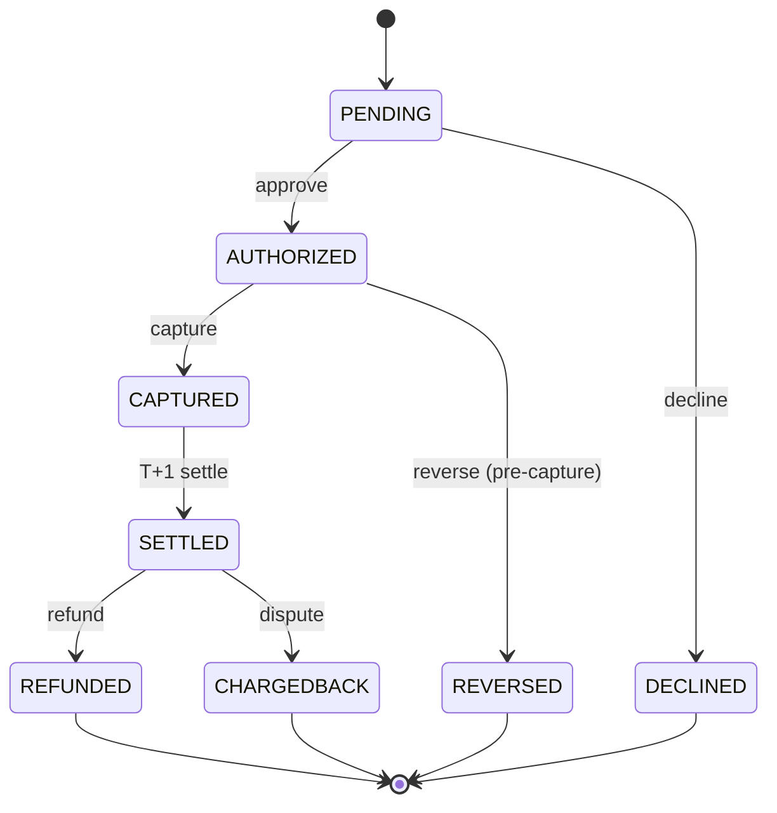

### 11.2 Saga instance

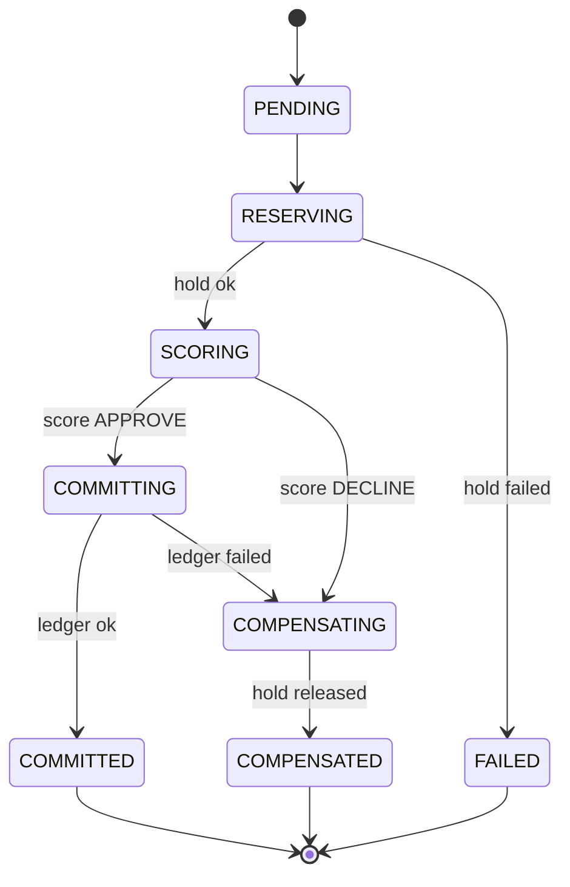

### 11.3 Settlement batch

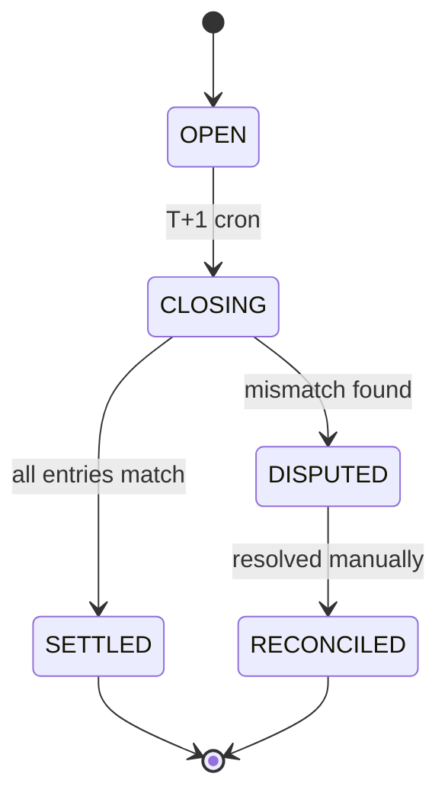

### 11.4 Outbox event

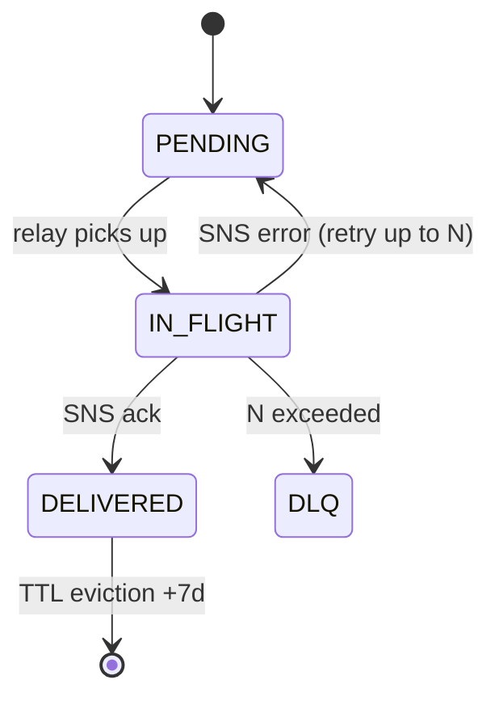

---

## 12. Consistency model

**The system is a hybrid: strong consistency on the hot path's write contract, eventual consistency on the async fan-out.**

| Store | Operation | Consistency |
|---|---|---|
| DynamoDB | Conditional `PutItem` / `TransactWriteItems` | Strong within the partition; transactions are linearizable per item collection |
| DynamoDB | `Query` on GSI | Eventually consistent (Dynamo limitation; we accept this for outbox relay) |
| Redis (single-shard ops) | Lua script | Strong (atomic per shard) |
| Redis (multi-key) | Forbidden across shards | n/a |
| Postgres | Single-row write | Strong |
| Postgres | Cross-table within txn | Strong (single-writer RDS) |
| SNS → SQS | Delivery | At-least-once, no order guarantee on Standard; FIFO topics give per-group ordering |

### Read-after-write semantics per access pattern

- **Idempotency lookup** uses the base table (strong) — must not race with the conditional put on first attempt.
- **Saga state read** uses the base table (strong) — resume must see the latest state.
- **Outbox relay** uses GSI3 (eventual) — acceptable: at-least-once is the contract; duplicate publishes are deduped by consumers on `event_id`.
- **Merchant view** (operator dashboard) uses GSI1 (eventual) — acceptable: minutes-stale is fine.
- **Balance read on the hot path** uses Redis (strong per shard); Postgres is recovery only.

### Conflict resolution

- **Balance write contention** → optimistic lock on `accounts.version`. Loser retries; if 3 retries fail, return 503 (rare).
- **Saga state contention** → version-locked; loser drops update (other coordinator already advanced state).
- **Outbox double-delivery** → consumers idempotent on `event_id`.

### Clock-skew assumptions

- `ULID` timestamps are monotonic within a single node but **not across nodes**. We rely on Dynamo's server-side conditional checks for correctness, not on client timestamps.
- Settlement window boundaries use server-side `now()` at the batch-close worker; never client time.

---

## 13. Performance design

### 13.1 Latency budget (expanded from roadmap §4)

| Hop | Budget (ms) | Measured how |
|---|---|---|
| Edge ingress (TLS + JWT) | 5 | Envoy access log timing |
| Edge → auth-service network | 2 | OTel span duration |
| Auth orchestration overhead | 5 | dispatch + saga init span |
| Idempotency lookup (Dynamo GetItem) | 5 | DDB metrics + span |
| Balance check (Redis) | 3 | Redis SLOWLOG + span |
| Fraud + ML (parallel to balance) | 25 | longest of (rules-eval, ml-call) span |
| Aggregate + decide | 1 | span |
| Ledger TransactWriteItems | 15 | DDB metrics + span |
| Response marshal + egress | 5 | span |
| **Slack** | **34** | computed |
| **Total target** | **100** | end-to-end p99 |

**Alert thresholds:** any hop over 1.5× budget for 5 min in staging fires a warning; 2× fires page.

### 13.2 Throughput design

- **Go goroutines:** per-request, no fixed pool — `errgroup` for fan-out within a request. Bounded by concurrency limit (`uber-go/ratelimit` semaphore) at 200 in-flight requests per pod to prevent OOM.
- **gRPC channels:** one channel per downstream service, multiplexed via HTTP/2 streams. Channel pool size = 4 to spread across server-side gRPC handlers.
- **DynamoDB:** on-demand mode; capacity scales automatically. 100k WCU/RCU burst available.
- **Redis pipelining:** balance-service batches Lua calls when possible (rarely possible on hot path — each request is independent).
- **Postgres connection pool:** PgBouncer transaction-mode, max 50 conns per service.

### 13.3 Scaling levers

| Lever | Trigger |
|---|---|
| HPA on CPU | scale up at 70 % CPU; down at 40 % |
| HPA on custom metric | `requests_in_flight > 150` triggers scale-up before CPU climbs |
| Dynamo on-demand → provisioned | move when sustained > 5k WCU/RCU for cost savings |
| Redis cluster reshard | when any shard > 75 % mem or > 30 k ops/sec |
| Postgres read replica add | when read latency p99 > 50 ms |
| EKS node group scale | Karpenter for spot + on-demand mix |

### 13.4 Caching strategy

| Cache | TTL | Invalidation |
|---|---|---|
| Account balance (Redis) | 5 min | Write-through on `Hold`/`Release`/`Capture`; Postgres is recovery only |
| Idempotency response (Redis) | 24 h | TTL only; Dynamo is durable copy |
| Merchant config (in-process) | 30 s | TTL only |
| JWKS keys (in-process) | 1 h | TTL only; kid-based rotation |
| Bloom filter: known-bad cards | persistent | Daily rebuild from fraud feedback |

Negative caching: declined card+merchant combos cached 60 s to absorb POS retry storms.

### 13.5 Tail latency mitigation

- **Hedged requests** to fraud-service: fire a second request after `p99/2` (50 ms), cancel the slower one when either returns. Only enabled in steady state (CB closed).
- **Deadline propagation:** every gRPC call has a deadline computed from the parent's remaining budget. No fresh `context.Background()`.
- **Circuit breaker:** opens after 20 consecutive errors OR > 50 % errors in a 10 s window. Half-open after 30 s.
- **Bulkhead:** separate gRPC connection per downstream — auth's pool to fraud cannot exhaust auth's pool to balance.
- **Load shedding:** at > 200 in-flight per pod, return 503 with `Retry-After`. Pod-level, not global.

---

## 14. Failure modes & recovery

### 14.1 Per-service matrix

| Service | Failure | Blast radius | Detection | Recovery |
|---|---|---|---|---|
| auth-service | Single pod crash | <1% requests, retried by client | `up` metric, restart count | k8s restarts; client retries (idempotency) |
| auth-service | All pods crash | 100% hot path | SLO burn alert (1m window) | Auto-rollback via Argo Rollouts |
| balance-service | Redis shard down | accounts in that shard | Redis `ping` metric | Replica promotes; cluster reshards |
| balance-service | Postgres write-through lag | recovery time increases | replication-lag metric | Drain queue; scale write workers |
| fraud-service | JVM heap exhaustion | scoring fails for that pod | OOMKilled events, GC pause | k8s restart; HPA spins more |
| fraud-service | ML sidecar unreachable | rules-only score (degraded) | `ml_calls_failed_total` | CB opens; fallback to rules; alert |
| ml-scorer | Model not loaded | startup fail (CrashLoop) | readiness probe | Block rollout; fix model artifact |
| ledger-service | Dynamo throttling | partial write failures | `ProvisionedThroughputExceeded` | on-demand absorbs; retry w/ backoff; alert if sustained |
| ledger-service | Outbox relay stopped | event publish lag | `outbox_pending_count` | Auto-scale relay; alert if > 5 min lag |
| settlement-service | Reconciliation mismatch | DISPUTED batch | DISPUTED counter | Manual reconciliation via runbook |
| notification-service | Merchant webhook 5xx | per-merchant delivery delay | DLQ size by merchant | Backoff handles; alert if DLQ > 1 k for a merchant |
| edge-gateway | Cert expired | full ingress outage | cert-manager alert + synthetic | cert-manager auto-renews; alert if < 7 d valid |

### 14.2 Datastore failures

- **Dynamo partial:** AWS regional outage; we accept this — the system is single-region in v1. RPO = 5 min via point-in-time recovery.
- **Redis shard down:** replica promotes within seconds; cluster reshards if primary unrecoverable. Account state for that shard goes through Postgres fallback temporarily (slower hot path, alert fires).
- **RDS failover:** Multi-AZ; failover ~30–60 s. Settlement and notification consumers retry; hot path unaffected.
- **S3 unavailable:** outbox archive pauses (in-memory queue); terraform state read-only. Tolerable for ~1 h.

### 14.3 Network partition

- **Edge ↔ internal:** detect via 5xx burst; clients see 503; circuit breakers open. No split-brain risk (no quorum-based protocol).
- **Auth ↔ ledger partition:** sagas pile up in `COMMITTING`; resume worker compensates after 30 s if partition heals slowly.
- **Cross-AZ partition (rare):** EKS keeps majority of pods in healthy AZs; HPA scales remaining; some latency increase.

### 14.4 Disaster recovery

| Target | Value | Mechanism |
|---|---|---|
| RPO ledger | ≤ 5 min | Dynamo point-in-time recovery |
| RPO Postgres | ≤ 5 min | Continuous WAL backup to S3 |
| RTO platform | ≤ 1 h | Terraform apply + ArgoCD sync from main |
| RTO data | ≤ 1 h | Restore Dynamo + Postgres from snapshot |

DR runbook lives at `observability/runbooks/dr-restore.md` and is exercised quarterly (designed; not actually scheduled in v1).

### 14.5 Chaos test catalog

| Experiment | Schedule | Expected behavior |
|---|---|---|
| Kill 1 auth-service pod | nightly | < 0.1 % request errors; k8s restarts within 10 s |
| Kill 1 ledger-service pod | nightly | sagas resume; no orphan holds |
| Inject 200 ms latency on fraud-service | weekly | hedged requests fire; p99 stays < 120 ms |
| Inject 50 % error rate on fraud-service | weekly | CB opens within 10 s; rules-only degrade; alert |
| Network partition auth ↔ ledger | weekly | sagas compensate within 30 s of heal |
| Drop Redis shard primary | weekly | replica promotes; hot path < 30 s blip |
| Throttle Dynamo writes 50 % | weekly | retries with jitter absorb; alert if sustained > 5 min |

---

## 15. Security design

### 15.1 Threat model summary (STRIDE per boundary)

| Boundary | Spoofing | Tampering | Repudiation | Info disclosure | DoS | Elevation |
|---|---|---|---|---|---|---|
| Internet → edge | mTLS optional + JWT | TLS 1.3 | Audit log | TLS; PAN tokenized | Envoy rate limit + WAF | Strict scope JWT |
| Edge → internal mesh | mTLS required | mTLS | Audit log | mTLS encrypts | per-pod limits | IRSA per service |
| Service → Dynamo/Redis/RDS | IRSA / IAM | TLS to AWS | CloudTrail | TLS in transit; KMS at rest | service-level quotas | IAM-scoped policies |
| Event bus (SNS/SQS) | IAM | TLS | CloudTrail | KMS-encrypted topics | Account-level quotas | Topic-scoped IAM |
| Admin plane (kubectl, ArgoCD) | SSO + MFA | RBAC | audit log | encrypted | per-user limits | RBAC roles |

Full threat model lives in `docs/threat-model.md`.

### 15.2 PAN tokenization

**Goal:** real PAN never leaves the edge gateway. Everything downstream uses an opaque token.

**Envelope encryption:**

```
At tokenization (edge):
  DEK = KMS.GenerateDataKey(key_id=PAN_KEK, key_spec=AES_256)
  ciphertext = AES-GCM(DEK.Plaintext, PAN, AAD=card_token_id)
  token = base64(card_token_id || DEK.CiphertextBlob || ciphertext)
  // DEK.Plaintext discarded immediately

At detokenization (settlement/recon only, audited):
  parse(token) → card_token_id, DEK_ciphertext, ciphertext
  DEK_plaintext = KMS.Decrypt(DEK_ciphertext)
  PAN = AES-GCM-decrypt(DEK_plaintext, ciphertext, AAD=card_token_id)
```

Token format is irreversible without KMS access. KMS keys rotate annually with both keys active during a 30-day overlap.

### 15.3 mTLS topology

- **In-cluster:** cert-manager issues certificates from an internal CA; Envoy SDS distributes them. Rotation every 24 h, validity 48 h (auto-renew at 50 %).
- **SPIFFE/SPIRE evaluated** (ADR-0009) — not chosen for v1 due to operational overhead; revisited at multi-cluster.
- **Edge ingress:** TLS 1.3 only; ECDHE + AES-GCM. ACM-managed cert for the public domain.

### 15.4 JWT / authn / authz

- **Algorithm:** RS256. **Issuer:** internal auth service (TBD; for v1 a mock).
- **Claims:** `iss`, `sub` (merchant_id), `scope` (e.g. `auth:write`, `capture:write`), `iat`, `exp` (5 min), `jti`.
- **JWKS endpoint** exposed by issuer; Envoy JWT filter caches keys 1 h with kid-based selection on rotation.
- **Rotation procedure** in `observability/runbooks/jwt-rotation.md`.

### 15.5 Secrets management

| Secret class | Store | Rotation |
|---|---|---|
| Database passwords | AWS Secrets Manager | 90 d auto |
| JWT signing keys | AWS Secrets Manager (private), KMS-protected | Annual |
| Merchant webhook secrets | AWS Secrets Manager | Per-merchant, on demand |
| KMS keys | KMS itself | Annual (with overlap) |
| In-cluster TLS certs | cert-manager | 24 h |

Local dev uses LocalStack Secrets Manager with `.env.example` documenting the schema.

### 15.6 Audit logging

Every administrative action and every cross-PCI-boundary call writes to `audit_log` (Postgres partitioned table) with `actor`, `action`, `target`, `metadata` JSON. Retention 7 years (regulatory norm), cold-stored in S3 Glacier after 90 days.

### 15.7 PCI DSS scope reduction strategy

- PAN exists in cleartext **only** within the edge gateway pod for the lifetime of one request (< 100 ms).
- Internal services see only tokens; logs and traces filter at the SDK layer to refuse any field matching the PAN regex.
- Cardholder data storage (Postgres) holds tokens, not PAN.
- Network segmentation: edge in a dedicated namespace with a NetworkPolicy denying egress to anywhere except `auth-service` and `kms.<region>.amazonaws.com`.

---

## 16. Observability design

### 16.1 SLO catalog

| SLI | SLO | Window | Burn-rate alerts (multi-window) |
|---|---|---|---|
| Auth latency p99 < 100 ms | 99 % of windows | 30 d | 1h burn > 14.4× (fast) and 6h burn > 6× (slow) |
| Auth availability (success / total) | 99.9 % | 30 d | 1h > 14.4× ; 6h > 6× |
| Capture success rate | 99.95 % | 30 d | 1h > 14.4× |
| Saga completion < 5 s | 99.5 % | 30 d | 1h > 14.4× |
| Outbox lag < 60 s | 99 % | 30 d | 1h > 14.4× |
| Webhook delivery success (first attempt) | 95 % | 7 d | warn-only |

Each SLO has a corresponding alert + runbook entry.

### 16.2 Metric naming conventions

Pattern: `<service>_<resource>_<action>_<unit>`.

Examples: `auth_authorize_duration_seconds`, `ledger_writes_total`, `redis_holds_active`, `outbox_pending_count`, `ml_scorer_inference_duration_seconds{model_version}`.

**Cardinality budget:** max 1 000 series per metric. High-cardinality labels (account_id, txn_id) are forbidden — those go in traces/logs.

### 16.3 Log schema

Required JSON fields on every log line:

```json
{
  "ts":         "2026-05-17T12:34:56.789Z",
  "level":      "INFO",
  "service":    "auth-service",
  "env":        "staging",
  "version":    "v1.4.2",
  "trace_id":   "00-...-01",
  "span_id":    "...",
  "msg":        "saga compensated",
  "...":        "context-specific keys"
}
```

Forbidden in logs (CI grep): `pan`, `cvv`, `card_number`, raw JWT, full token (only `tok_prefix` allowed).

### 16.4 Trace propagation

W3C `traceparent`; OTel SDK in every language. Baggage carries `tenant_id`, `merchant_id` for cross-cut filtering.

Sampling: 100 % in staging; 1 % head sampling in prod with **tail sampling** keeping all error traces and all traces > 90 ms (close to budget).

### 16.5 Dashboard inventory

| Dashboard | Purpose |
|---|---|
| `hot-path-latency` | p50/p95/p99 per hop, error rate, throughput |
| `decision-mix` | APPROVE / DECLINE / REVIEW rates by merchant, reason codes |
| `saga-states` | PENDING / IN_FLIGHT / COMPENSATED / FAILED counts |
| `datastore-health` | Dynamo throttles, Redis ops/sec + memory, Postgres connections |
| `circuit-breakers` | open/half-open events by downstream |
| `slo-burn` | error budget remaining + burn rate panels |
| `cost-tracker` | infracost-derived spend; auto-shutdown timer |

### 16.6 Runbook index

One markdown per alert under `observability/runbooks/`. Required sections: **Symptom**, **Probable cause(s)**, **First moves**, **Escalation**, **Postmortem template link**.

---

## 17. Deployment topology

### 17.1 AWS account & VPC layout

- One AWS account per env (`dev`, `staging`, `prod-designed`).
- Single VPC per env, three AZs, private subnets for workloads + DBs, public subnets for NAT and ALB.
- VPC endpoints (interface) for KMS, Secrets Manager, SQS, SNS, STS — eliminates NAT egress for AWS API calls.
- Transit Gateway is *not* used (single VPC v1).

### 17.2 EKS cluster

| Pool | Instance types | Purpose | Notes |
|---|---|---|---|
| `system` | `m6i.large` (on-demand) | core add-ons (cert-manager, coredns, otel collector, argocd) | 2 × across AZs |
| `app` | `m6i.xlarge` (on-demand) | hot-path services | min 3, max 12 |
| `batch` | `m6i.large` (spot) | settlement, notification, chaos | spot tolerant |

- IRSA for every service (IAM Role per K8s ServiceAccount).
- Taints: `dedicated=batch:NoSchedule` on the batch pool to keep hot-path off it.
- Karpenter handles node provisioning beyond the static pools.

### 17.3 Helm chart structure

```
infra/helm/
├── umbrella/
│   ├── Chart.yaml              # depends on every subchart
│   └── values-{env}.yaml
└── charts/
    ├── auth-service/
    │   ├── templates/
    │   │   ├── deployment.yaml
    │   │   ├── service.yaml
    │   │   ├── hpa.yaml
    │   │   ├── servicemonitor.yaml
    │   │   ├── prometheusrule.yaml
    │   │   └── networkpolicy.yaml
    │   └── values.yaml
    ├── balance-service/
    ├── fraud-service/
    ├── ledger-service/
    ├── ml-scorer/
    ├── settlement-service/
    ├── notification-service/
    └── edge-gateway/
```

Common templates (labels, image pull, probe defaults) live in a `_helpers.tpl` shared via Helm library chart.

### 17.4 ArgoCD app-of-apps + sync waves

```
root-app (auto-sync from main)
 ├── wave 0: namespaces, CRDs (cert-manager, prometheus-operator, argo-rollouts)
 ├── wave 1: cluster add-ons (cert-manager, ingress, otel collector)
 ├── wave 2: data plane (external secrets pointing to AWS SM)
 ├── wave 3: app services (umbrella chart)
 └── wave 4: ingress + DNS (Envoy + Route53)
```

### 17.5 Argo Rollouts blue/green

- Stable + preview ReplicaSets.
- Pre-promotion analysis template runs k6 smoke + checks Prometheus SLO burn over a 10 min window.
- Auto-promote on green; auto-rollback on red.
- Manual gate available via `argo rollouts promote` for sensitive deploys.

### 17.6 Multi-env topology

| Env | Stack | Purpose |
|---|---|---|
| `local` | docker-compose + LocalStack | inner loop, no AWS spend |
| `staging` | real AWS, scaled-down (3 AZ, smaller instances) | integration, soak, demo |
| `prod-designed` | full scale baseline; **not actually deployed** | architectural completeness for resume |

Promotion: PR merged to `main` → CI builds + signs images → ArgoCD auto-syncs staging → manual promotion to prod.

### 17.7 CI/CD pipeline

- **Per-service CI matrix** (GitHub Actions): lint → unit → integration (testcontainers) → build → sign (cosign keyless via OIDC) → SBOM (syft) → push to ECR.
- **Pact contract tests** run on proto-changing PRs.
- **Terraform CI:** fmt + tflint + tfsec + checkov + infracost diff posted to PR.
- **No static AWS creds anywhere** — GitHub Actions assume IAM roles via OIDC.

---

## 18. Operational concerns

### 18.1 Backup & restore

| Asset | Backup | Restore RTO |
|---|---|---|
| Dynamo | Point-in-time recovery (35 d) | ≤ 30 min |
| RDS Postgres | Automated daily snapshots + WAL | ≤ 60 min |
| S3 (terraform state) | Versioning + MFA delete | minutes |
| Secrets Manager | Account-level snapshots | manual reseed if lost |

Restore procedures in `observability/runbooks/restore-*.md`. Quarterly drill — schedule on calendar.

### 18.2 Key rotation cadence

| Key | Cadence | Procedure |
|---|---|---|
| KMS (PAN tokenization) | annual, 30-day overlap | `runbooks/kms-rotation.md` |
| JWT signing | annual | `runbooks/jwt-rotation.md` |
| mTLS service certs | 24 h | automated by cert-manager |
| Merchant webhook secrets | on demand | `scripts/rotate-webhook.sh` |
| RDS passwords | 90 d | Secrets Manager auto |

### 18.3 Schema migration

- **Dynamo:** additive-only (no remove attributes). New access patterns require either a new GSI or a new item-type prefix — never repurposing existing keys.
- **Postgres:** `goose` migrations checked into `services/<svc>/migrations/`. Online DDL discipline: prefer `ADD COLUMN ... NULL`, then backfill, then `NOT NULL`. Reject `DROP COLUMN` on hot tables in CI without a migration-plan comment.
- **Protobuf:** add fields with new tags only. `buf breaking` enforced.

### 18.4 Capacity reviews

Quarterly review: actual vs estimated for §5 numbers, scaling threshold tuning, cost trend, SLO trend.

### 18.5 Incident response

- **Severity ladder:** SEV1 (full outage), SEV2 (degraded), SEV3 (single-tenant or non-critical).
- **Single-engineer rotation** for v1 — documented for completeness; not an actual on-call obligation.
- **Postmortem template** at `docs/postmortem-template.md`. Blameless, action-item driven.

---

## 19. Compliance & regulatory

### 19.1 PCI DSS-aware design

Designed-for, not certified. Controls mapped to design choices:

| Req | Design choice |
|---|---|
| 3.4 PAN unreadable | KMS envelope encryption + tokenization at edge |
| 4.1 Encrypt in transit | TLS 1.3 edge; mTLS internal |
| 8.x Access control | IRSA + RBAC + SSO; least-privilege IAM policies |
| 10.x Audit log | `audit_log` Postgres table; immutable retention |
| 11.x Vulnerability mgmt | trivy + osv-scanner + dependabot in CI |
| 12.x Policy | this document + agents.md + runbooks |

### 19.2 Data residency

Single region v1. Multi-region considered in stretch goals; would use DynamoDB Global Tables and aurora-global for the relational store.

### 19.3 Right-to-erasure

Tokenization helps: erasing the cardholder's `card_token_id` mapping renders any historical ciphertext useless. Audit log retention overrides erasure for regulatory reasons (documented exception).

---

## 20. Migration & rollout

This is a **greenfield** build, so "migration" maps onto the phased rollout in [roadmap.md §9](roadmap.md#9-roadmap-by-phase). One-liner per phase:

| Phase | What ships |
|---|---|
| 0 | Repo, tooling, local stack, CI bones |
| 1 | Hot path MVP (Go services + Dynamo + Redis) |
| 2 | Fraud + ML (Java + Python sidecar) |
| 3 | Saga + compensation |
| 4 | Resilience (CB, retry, bulkhead, hedging) |
| 5 | Observability stack |
| 6 | Security (mTLS, tokenization, threat model) |
| 7 | Async backbone + settlement |
| 8 | Terraform IaC |
| 9 | EKS + Helm + ArgoCD + chaos |
| 10 | Polish + story |

**Feature flag strategy:** OpenFeature with a GoFeatureFlag provider. Every new fraud rule ships behind a flag with a removal date in the same PR (enforced by `agents.md` §11).

**Backfill:** n/a for greenfield.

**Rollback playbook:**
- Code: `argo rollouts abort` reverts to the stable RS within seconds.
- Schema: Dynamo is additive; Postgres requires `goose down` plus data check.
- Config: Helm rollback via ArgoCD UI.

---

## 21. Trade-offs explicitly considered

### 21.1 Saga vs 2PC

| | Saga | 2PC |
|---|---|---|
| **Pros** | Loosely-coupled, async-friendly, scales | Strong consistency, simple mental model |
| **Cons** | Compensation logic to write, eventually consistent | Coordinator is SPOF, blocking, doesn't fit cross-DB-vendor |
| **Picked** | **Saga** — Dynamo+Redis+Postgres don't share a coordinator |
| **Revisit when** | Single store can satisfy all writes |

### 21.2 DynamoDB vs Aurora for ledger

| | Dynamo | Aurora |
|---|---|---|
| **Pros** | Predictable single-digit-ms latency, conditional writes, no schema migration pain | Joins, complex queries, mature tooling |
| **Cons** | No joins, eventual on GSIs, single-table cognitive load | Higher latency tail, scaling at write volume |
| **Picked** | **Dynamo** — Visa-JD match, latency profile fits hot path |
| **Revisit when** | Query patterns require joins or analytics > 5× the write workload |

### 21.3 gRPC vs REST internal

| | gRPC | REST |
|---|---|---|
| **Pros** | Strict contracts, codegen, HTTP/2 streams, deadline propagation | Browser-friendly, debuggable with curl |
| **Cons** | Less debuggable, requires tooling | Loose contracts, manual serialization |
| **Picked** | **gRPC internal**, REST external |
| **Revisit when** | A non-Go/Java/Python consumer needs internal access |

### 21.4 Go vs Rust on hot path

| | Go | Rust |
|---|---|---|
| **Pros** | Mature gRPC, easy concurrency, fast dev | Predictable latency (no GC), zero-cost abstractions |
| **Cons** | GC pauses (typically < 1 ms on tuned services) | Longer dev cycle, smaller ecosystem for our stack |
| **Picked** | **Go** — matches Visa JD; GC budget fits |
| **Revisit when** | GC tail dominates the 100 ms budget (it doesn't yet) |

### 21.5 Spring WebFlux vs Quarkus

| | WebFlux | Quarkus |
|---|---|---|
| **Pros** | Industry standard at banks, large hiring pool | Sub-50 ms cold start (native image), low memory |
| **Cons** | Heavier startup, reactive learning curve | Less common at Visa-style shops |
| **Picked** | **WebFlux** — resume signal for fintech |
| **Revisit when** | Cold start matters (serverless-style) |

### 21.6 SNS+SQS vs Kafka

| | SNS+SQS | Kafka (MSK) |
|---|---|---|
| **Pros** | Managed, low ops, pay-per-use | Replayable, ordered, infinite retention |
| **Cons** | No replay, no strong ordering on Standard | Operational complexity, sizing matters |
| **Picked** | **SNS+SQS** — Visa JD match, outbox + idempotent consumers give us at-least-once |
| **Revisit when** | We need long-window replay or event sourcing |

### 21.7 ArgoCD vs Flux

| | ArgoCD | Flux |
|---|---|---|
| **Pros** | UI, app-of-apps, sync waves, mature | GitOps Toolkit, modular |
| **Cons** | Heavier, opinionated | Less of a "platform", more components to wire |
| **Picked** | **ArgoCD** — better UX for a single-engineer deploy story |
| **Revisit when** | Operating a large multi-tenant platform |

### 21.8 Linkerd vs Istio

| | Linkerd | Istio |
|---|---|---|
| **Pros** | Light, simple, fast | Feature-rich, large community |
| **Cons** | Fewer features (no rich authz) | Complex, heavier resource footprint |
| **Picked** | **Envoy SDS for mTLS, no full mesh in v1.** Reconsider Linkerd if multi-cluster |
| **Revisit when** | Cross-cluster traffic, mTLS-everywhere becomes mandatory |

---

## 22. Open questions

| # | Question | Owner | Due |
|---|---|---|---|
| Q-001 | Outbox relay: in-process goroutine vs dedicated worker pod? Trade-off: ops simplicity vs scaling independence. | ADR-0008 author | Phase 7 |
| Q-002 | Should `fraud-service` use virtual threads for the rule pipeline now or stay reactive? Benchmark required. | TBD | Phase 4 |
| Q-003 | What's the actual AUC we hit on synthetic data? If < 0.85, do we ship the model honestly or wait? | Phase 2 owner | Phase 2 |
| Q-004 | Real KMS in staging or LocalStack KMS only? Real KMS costs ~$1/key/month — acceptable. | Phase 6 | Phase 6 |
| Q-005 | Cardinality budget enforcement: do we add a Prometheus relabel-drop rule, or rely on review? | Phase 5 | Phase 5 |
| Q-006 | Should we add Kafka swap as stretch, or defer to a v2 project entirely? | User | post-Phase 10 |

---

## 23. ADR index

Living list — every architecture decision gets a numbered file in `docs/adr/`.

| ADR | Title | Status |
|---|---|---|
| 0001 | Record architecture decisions | accepted |
| 0002 | Go on the hot path | accepted |
| 0003 | DynamoDB single-table design | accepted |
| 0004 | Saga vs 2PC | accepted |
| 0005 | Idempotency strategy | accepted |
| 0006 | mTLS via Envoy SDS, no full mesh in v1 | accepted |
| 0007 | Rule + ML score aggregation (additive) | accepted |
| 0008 | Outbox relay deployment (in-process vs worker) | open |
| 0009 | SPIFFE/SPIRE not adopted in v1 | accepted |
| 0010 | Kafka swap deferred to stretch | accepted |
| 0011 | Single region for v1 | accepted |
| 0012 | Tokenization at edge, KMS envelope | accepted |

---

## 24. Glossary

For domain and tool terminology see [agents.md §13](agents.md#13-glossary-so-we-speak-the-same-language) — not duplicated here. Document-specific shorthand:

- **Hot path** = the synchronous authorize flow: edge → auth → (balance ∥ fraud) → ledger → response.
- **Async tail** = everything downstream of the outbox publish: settlement, notification, analytics, fraud feedback.
- **Decision bucket** = the mapping from numeric score (0–1000) to `{APPROVE, REVIEW, DECLINE}`.
- **Compensating transaction** = a write that undoes an earlier write in the same saga (e.g. release a hold).
- **Outbox** = the pattern of writing an event row in the same database transaction as the state change.

---

## 25. References

- [ISO 8583 Wikipedia](https://en.wikipedia.org/wiki/ISO_8583) — message format and reason codes
- [AWS Well-Architected Framework](https://aws.amazon.com/architecture/well-architected/) — operational excellence, security, reliability, performance, cost
- [Stripe API: Idempotent Requests](https://stripe.com/docs/api/idempotent_requests) — canonical reference
- [Google SRE: SLOs](https://sre.google/sre-book/service-level-objectives/) — SLO/SLI/error-budget methodology
- [PCI DSS v4.0 Quick Reference Guide](https://www.pcisecuritystandards.org/) — control catalogue
- [Pat Helland — "Life beyond Distributed Transactions"](https://queue.acm.org/detail.cfm?id=3025012) — saga foundations
- [Martin Kleppmann — *Designing Data-Intensive Applications*](https://dataintensive.net/) — consistency, ordering, replication
- [Brendan Burns et al. — *Designing Distributed Systems*](https://azure.microsoft.com/en-us/resources/designing-distributed-systems/)
- [The Twelve-Factor App](https://12factor.net/) — operational baseline
